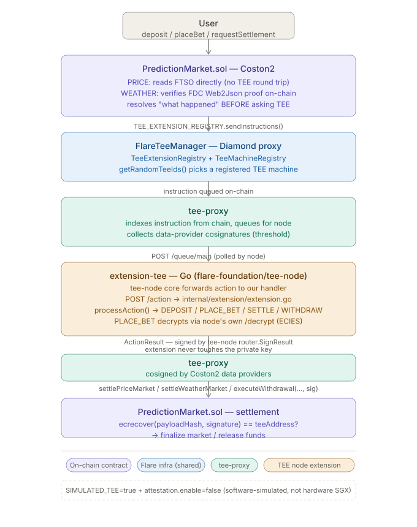

# Flare Prediction Market

## 🚀 Live Demo

| Resource | Link |
|----------|------|
| **Frontend** | https://flare-prediction-market.vercel.app |
| **TEE Proxy** | https://flare-tee.idolpulse.com |
| **Contract (Coston2)** | [0x9C22c9F1954f2E1D7B305c0E2932edEBE713bDc3](https://coston2-explorer.flare.network/address/0x9C22c9F1954f2E1D7B305c0E2932edEBE713bDc3) |
| **FlareTeeManager** | [0x1a9C4A0f9D76c0b1D91d22E24E573a9b377618aE](https://coston2-explorer.flare.network/address/0x1a9C4A0f9D76c0b1D91d22E24E573a9b377618aE) |

> Confidential prediction market on Flare Coston2 — bets encrypted with ECIES before hitting the chain, settled trustlessly via FCC/TEE + FTSO/FDC.

---

[](https://github.com/pplmaverick/flare-prediction-market/actions/workflows/ci.yml)


A confidential dual-market prediction platform built for Flare's native stack —
FTSO for price feeds, FDC for cross-chain weather data, and Flare Confidential
Compute (FCC/TEE) for an encrypted bet ledger. This is purpose-built on Flare's
primitives, not a generic EVM prediction market ported over with a Chainlink
feed swapped in.

---

## Why Flare-Native

Every core mechanism in this project maps to a Flare-specific primitive — none
of these are things you'd reach for on a generic EVM chain.

| Problem | Generic EVM approach | Flare-native approach |
|---|---|---|
| Settlement price source | Chainlink price feed, off-chain keeper | **FTSO** — `ContractRegistry.getTestFtsoV2().getFeedById()`, a free on-chain view call, no oracle fee, no keeper |
| Bet privacy | Plaintext bet amount/side stored on-chain (front-runnable, fully public) | **FCC/TEE** — bets are ECIES-encrypted client-side against the TEE's public key; the plaintext ledger only ever exists inside the TEE's memory |
| Off-chain weather data → on-chain settlement | Centralized oracle push, or a custom bridge with its own trust assumptions | **FDC (Flare Data Connector)** — OpenWeatherMap data enters via a Web2Json attestation, verified on-chain with a Merkle proof (`IFdcVerification.verifyWeb2Json`), independent of the TEE |
| TEE-computed results reaching the contract | Custom multisig / centralized relayer signs off | Flare's shared **FlareTeeManager** registry (`TeeExtensionRegistry` + `TeeMachineRegistry`) routes instructions to a registered TEE machine and the contract verifies the result via `ecrecover` against the TEE's registered address |

---

## Architecture



---

## Core Features

### Dual market types, one settlement pipeline
`PRICE` markets settle against an FTSO feed (e.g. BTC/USD); `WEATHER` markets
settle against an FDC-verified OpenWeatherMap reading. Both resolve the
outcome fully on-chain, independent of the TEE — the TEE's job is uniform
across both: decrypt the private bet ledger, compute payouts, sign the result.

### Confidential bet ledger
`placeBet()` carries ECIES ciphertext on-chain (encrypted client-side against
the TEE's published public key). The existence and timestamp of a bet is
public — provable no one bet after expiration — but the side and amount stay
private until the TEE computes payouts at settlement.

### Vault-style deposits, TEE-authorized withdrawals
The contract only custodies the pooled ERC-20 balance; per-user available/locked
balances live in TEE memory. Withdrawals execute against a TEE signature over
`(amount, to, withdrawalId)`, replay-protected by a one-shot `withdrawalId`.

---

## Deployed Contracts

**Coston2 Testnet (114)**

| Contract | Address |
|---|---|
| PredictionMarket | `0x9C22c9F1954f2E1D7B305c0E2932edEBE713bDc3` |
| FlareTeeManager *(shared Flare infra — TeeExtensionRegistry + TeeMachineRegistry)* | `0x1a9C4A0f9D76c0b1D91d22E24E573a9b377618aE` |

---

## Quick Start

**Prerequisites**
- [Foundry](https://getfoundry.sh/) (`forge`, `cast`)
- Node.js 20+ (for the TEE extension)
- A funded Coston2 wallet ([faucet](https://faucet.flare.network/coston2))

```bash
# Contracts
cd contracts
forge soldeer install     # pulls forge-std / OpenZeppelin / flare-periphery
forge build
forge test

# TEE extension
cd ../extension
npm install
cp .env.example .env
npm run build
```

| Variable | Description |
|---|---|
| `DEPLOYMENT_PRIVATE_KEY` | Funded Coston2 key for deploys and admin calls (`setTeeAddress`, `setPayToken`) |
| `CHAIN_URL` | Coston2 RPC (`https://coston2-api.flare.network/ext/C/rpc`) |
| `SIMULATED_TEE` | `true` in local/dev mode, `false` for real attestation |

```bash
# Frontend
cd ../frontend
npm install
cp .env.example .env.local
npm run dev
```

See [frontend/README.md](frontend/README.md) for setup details and known gaps.

---

## Contract Interface

```solidity
// Admin
function setTeeAddress(address _teeAddress) external onlyOwner;
function setPayToken(address _token) external onlyOwner;

// Market creation
function createMarket(MarketType marketType, bytes calldata typeParams, uint256 duration)
    external returns (uint256 marketId);

// Vault
function deposit(uint256 amount) external payable;             // payable: TEE registry fee
function withdraw(uint256 amount, address to) external payable;
function executeWithdrawal(uint256 amount, address to, bytes32 withdrawalId, bytes calldata signature) external;

// Betting
function placeBet(uint256 marketId, bytes calldata encryptedBet) external payable;

// Settlement
function requestPriceSettlement(uint256 marketId) external payable;
function requestWeatherSettlement(uint256 marketId, IWeb2Json.Proof calldata proof) external payable;
function settlePriceMarket(bytes calldata resultData, bytes32 actionId, string calldata submissionTag, uint8 status, bytes calldata signature) external;
function settleWeatherMarket(bytes calldata resultData, bytes32 actionId, string calldata submissionTag, uint8 status, bytes calldata signature) external;

// Views
function marketCount() external view returns (uint256);
function getMarket(uint256 marketId) external view returns (Market memory);
```

---

## Implementation Notes

<!-- Pitfalls hit while building against Flare's TEE stack. -->

**TEE identity is ephemeral — every container restart needs a new `setTeeAddress()`**
`tee-node`'s `node.Initialize()` calls `crypto.GenerateKey()` fresh on every
process start with no persistence (`node.ZeroState{}`). Rebuilding or
restarting the `extension-tee` container produces a brand-new keypair, so the
contract's `teeAddress` immediately goes stale. The correct address isn't a
literal field in `/info` — it's derived from `teeInfo.publicKey.{x,y}` via the
standard secp256k1 → Ethereum address formula (`keccak256(x‖y)`, last 20
bytes). Don't use `machineData.initialOwner` — that's a separately configured
governance address, unrelated to the TEE's own signing key.

**`deposit()` is `payable` — it needs a fee for the TEE registry, or it reverts `FeeTooLow`**
Internally it forwards `msg.value` as `TEE_EXTENSION_REGISTRY.sendInstructions{value: fee}()`.
Calling it with `value: 0` reverts with the custom error `FeeTooLow` (`0x732f9413`).
The minimum is a small, sub-cent amount of native token — worth confirming
with `cast estimate` (a free simulation, no broadcast) rather than guessing.

**`ActionResult` signing is automatic — don't manage keys in the extension handler**
`tee-node`'s router signs whatever `ActionResult` the extension returns from
`POST /action` (via `router.SignResult`, using the node's own identity key) —
this already matches the domain-separated hash scheme `PredictionMarket.sol`
verifies with `ecrecover`. The extension only needs to call the node's own
`/decrypt` endpoint (loopback-only, same container) to decrypt `PLACE_BET`'s
ECIES ciphertext — it never touches a private key directly.

**Go tooling under `tools/` doesn't auto-load the project's root `.env`**
Scripts like `post-build.sh` source `.env` themselves, but a direct
`cd tools && go run ./cmd/register-tee ...` does not — the tool reads
`DEPLOYMENT_PRIVATE_KEY`/`CHAIN_URL`/etc. straight from the process
environment. Run `set -a; source ../.env; set +a` first, or the tool fails
with unhelpful "empty private key" style errors instead of a clear "no .env"
message.

**`SETTLE` message decoding: the reference TS implementation drops a field**
`PredictionMarket.sol`'s `SettleMessage` ABI-encodes 4 fields —
`(uint256 marketId, address contractAddr, bool outcome, uint256 referenceValue)`
— matching what `_verifyAndDecodeSettleResult` expects back in
`ActionResult.Data`. The original TypeScript extension prototype decoded (and
re-encoded) only 3 fields (`uint256, bool, uint256`), silently dropping
`contractAddr`. The Go port decodes and re-encodes all 4 fields — worth
double-checking anywhere this message shape gets touched again.

**ECIES ciphertext must match go-ethereum's `ecies` package, not `eccrypto`'s defaults**
JS `eccrypto`'s default `encrypt()` produces AES-256-CBC ciphertext wired as
`iv‖ephemPubKey‖mac‖ciphertext`. `tee-node`'s `/decrypt` endpoint wraps
go-ethereum's `crypto/ecies` (`ECIES_AES128_SHA256`), which uses AES-128
**CTR**, a different KDF (NIST SP 800-56 concat KDF plus a second SHA-256 pass
over `Km`), and wires the output as `ephemPubKey‖iv‖ciphertext‖mac`. Encrypting
with `eccrypto` and sending that ciphertext as-is makes `/decrypt` return HTTP
400. No off-the-shelf JS library reproduces this exactly — reimplement it with
Node's `crypto` module (`createECDH('secp256k1')` + `aes-128-ctr` +
HMAC-SHA256) to match go-ethereum byte-for-byte.

Implemented client-side in `frontend/src/lib/ecies.ts`'s `eciesEncrypt`
(`@noble/secp256k1` for ECDH + WebCrypto for AES-CTR/SHA-256/HMAC — browser
equivalent of the Node approach above, no server round-trip needed). Verified
2026-07-27 by encrypting a `(bool, uint256)` payload in JS against a
freshly-generated keypair and decrypting it with the actual
`go-ethereum@v1.17.4` + `tee-node@v0.0.23` code paths (pulled from the local
Go module cache) — byte-for-byte round-trip match, not just a read of the
source.

**`register-tee` must be re-run (not just `setTeeAddress()`) after every container restart**
The TEE's ephemeral key rotates on restart (see above), and `setTeeAddress()`
only updates the contract's copy of it. `TeeMachineRegistry` still needs a
fresh `rRap` run (pre-registration, attestation, FTDC availability check,
`ToProduction`) so the new key's `teeId` gets marked active — otherwise
`getRandomTeeIds()` keeps routing instructions across whatever `teeId`s are
already active, which after a few restarts includes stale entries tied to keys
nobody's listening on anymore. `getActiveTeeMachines`/`getTeeMachineStatus`
show which are still active; `pause(teeId)` (owner-only) retires the stale
ones so routing is deterministic again.

**Settlement is two on-chain steps, not one**
`requestPriceSettlement(marketId)` only reads the FTSO price and sends a
`SETTLE` instruction to the TEE — it doesn't touch `Market.settled`. The TEE's
signed result has to be fetched separately (`GET
/action/result/{actionId}?submissionTag=threshold` on the proxy's external
port) and submitted via `settlePriceMarket(resultData, actionId, "threshold",
1, signature)` before `settled` flips to `true`. The proxy also serves a
`submissionTag=end` result for the same `actionId` — that one carries an
internal vote-sequence/consensus payload, not the `(marketId, contractAddr,
outcome, referenceValue)` tuple `settlePriceMarket` expects; using it fails to
decode.

**The base `docker-compose.yaml` alone doesn't work — always add the `coston2` overlay**
`docker compose up -d` on its own resolves `ext-proxy`'s DB config to
`host.docker.internal:3306` with a hardcoded `root`/`root`/`db`, and nothing on
the host listens there, so `ext-proxy` panics on startup. Bring the stack up
with both files — `docker compose -f docker-compose.yaml -f
docker-compose.coston2.yaml up -d` — which swaps in the real Coston2 indexer
config and the `extension-scaffold-coston2` network.

---

## Stack

| Layer | Technology |
|---|---|
| Smart contract | Solidity 0.8.27, Foundry (soldeer for dependencies) |
| TEE extension | Go, `github.com/flare-foundation/tee-node` |
| Oracle | FTSO (price), FDC Web2Json (weather) |
| Confidential compute | Flare Confidential Compute (FCC) — ECIES-encrypted bet ledger |
| Frontend | Next.js 16 (App Router), wagmi + viem, Tailwind v4 |

---

## Roadmap

**✅ M1 — Contract & price markets (completed)**
- `PredictionMarket.sol` deployed to Coston2
- FTSO-backed `PRICE` markets: creation, betting, settlement

**✅ M2 — FCC/TEE extension handler (completed)**
- Go extension handler for `DEPOSIT` / `PLACE_BET` / `SETTLE` / `WITHDRAW`
- Confidential bet ledger via ECIES decryption on the TEE side

**🟡 M3 — Frontend integration (UI complete, live end-to-end test pending)**
- Wallet connect, market list/detail, vault, and create-market UI (`frontend/`)
- Client-side ECIES bet encryption, targeting `SIMULATED_TEE=true`'s wire format
- Settlement/withdrawal finalization UI built against the documented TEE
  proxy result endpoint, not yet exercised against a live proxy
- Still open: end-to-end test across all four op commands on Coston2 against
  the real (non-simulated) TEE, and wiring up WEATHER settlement's FDC proof
  flow in the UI

**⬜ M4 — Mainnet deployment**

---

## Developer

GitHub: [pplmaverick](https://github.com/pplmaverick)
Wallet: `0xed2B...78F5`

## License

MIT
